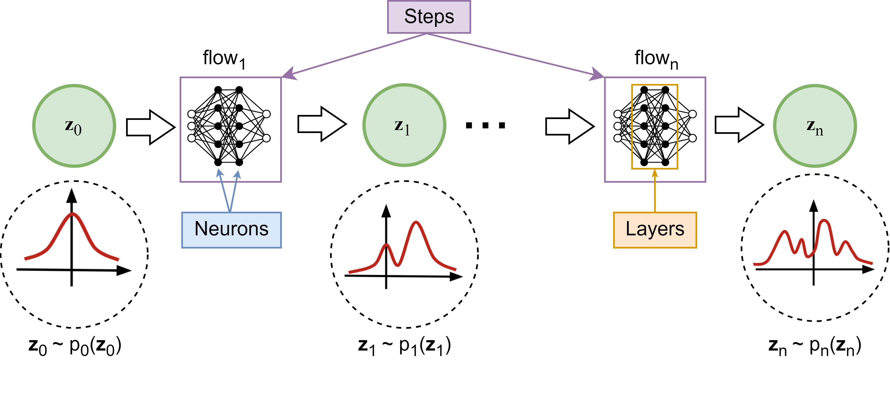
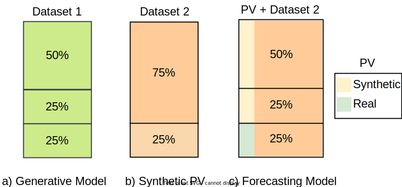
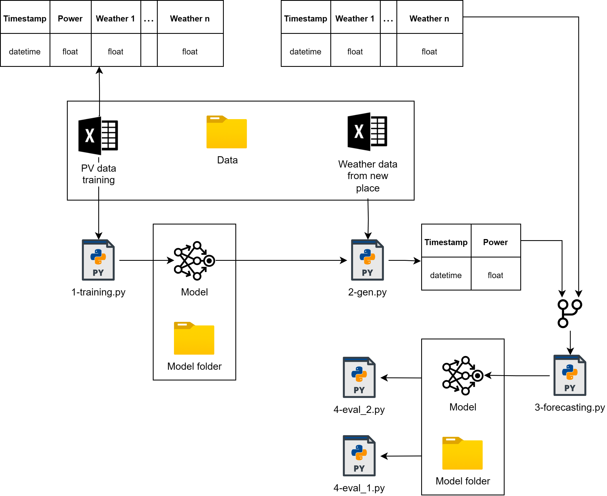
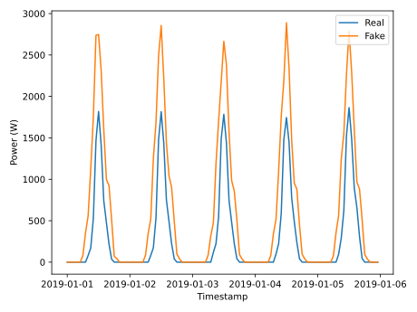
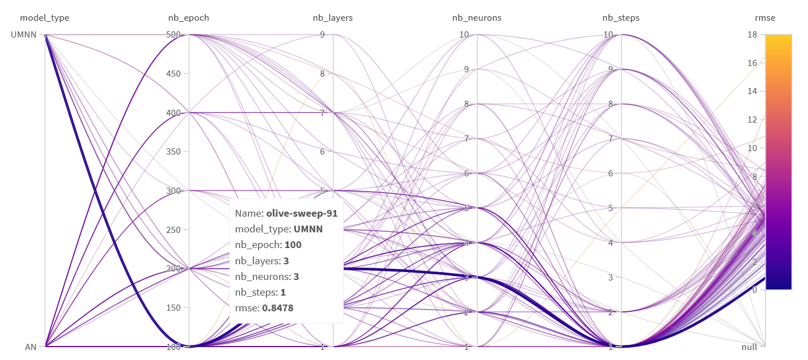
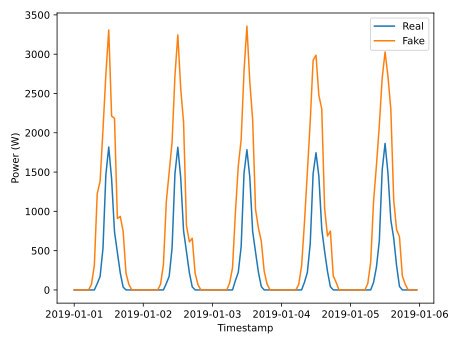

# `Synthetic Photovoltaic Power Curve using GANs and Transformers`

## Presentation

### Assignment 1

[Video on YouTube for the first assignment](https://youtu.be/TmnOccnPoUU)

### Assignment 2

[Slides](https://docs.google.com/presentation/d/1MgKqQnf7F7JzvSkJVg6RY7zdao9B-Bte/edit?usp=sharing&ouid=105026589240211170070&rtpof=true&sd=true)

### Assignment 3

[Slides](https://docs.google.com/presentation/d/1s3bzTyyO0hTWTvmFcjaD9GAqgSdZInZf/edit?usp=sharing&ouid=101611810474111417437&rtpof=true&sd=true)

This project presents an approach that uses a normalizing flow (NF) model to generate synthetic photovoltaic (PV) generation curves based on historical PV energy and weather data. It addresses the challenge of deploying energy management systems (EMSs) in new locations without historical data by creating synthetic PV data from weather information. Taking advantage of real data sets from photovoltaic installations, the study explores the generation of synthetic data to train photovoltaic forecasting models for the following day. Although promising in the reference work, the results reveal limitations in accurately representing the various climatic variations that affect photovoltaic production, affecting the generative model's ability to create representative synthetic data. In addition, transfer learning strategies faced obstacles in adjusting prediction models using synthetic data from different geographical areas. The project underlines the potential of generative models in energy forecasting. However, it highlights the need for improved methodologies and more reliable data to generate more representative synthetic data for effective transfer learning in new locations devoid of historical photovoltaic data.

Group:
|Names                                   | Academic Record |  Course                                         |
|----------------------------------------|-----------------|-------------------------------------------------|
| Cristian Javier Maza Merchan           | 272289          | 
M.Sc. Student of Electrical Engineering   (Telecommunications and Telematics)
|
| Juan Carlos Cortez Aucapiña            | 265568          | 
Ph.D. Student of Electrical Engineering   (Energy)
|
| Lucas Zenichi Terada                   | 182775          | 
M.Sc. Student of Electrical Engineering   (Energy)
|

## Abstract

This project proposes generating synthetic daily photovoltaic (PV) generation curves by leveraging historical PV power and weather data using generative models such as normalizing flows, conditional generative adversarial networks (GANs), and transformers. Subsequently, the trained model generates synthetic data for a different geographical location to complete missing data and train a day ahead PV forecasting model where only weather data is available. The forecasting model will be constructed using a Long Short-Term Memory (LSTM) network. The forecasting algorithm's performance will be evaluated based on Mean Absolute Error (MAE) and Root Mean Square Error (RMSE).

## Description

The increase of Distributed Energy Resources (DERs) integration into the distribution grid has heightened the need for Energy Management Systems (EMSs) to achieve optimal control of devices such as Battery Energy Storage Systems (BESS) and Electric Vehicle Charging Stations (EVCSs). Figure 1 illustrates an example environment in which an EMS is required to optimize Electric Vehicles (EVs) charging.

Figure 1: Example of environment that needs to be controlled with an EMS

To enhance the quality of energy management, predictions such as load and photovoltaic (PV) generation are necessary. However, how can an EMS be applied in a system without historical data? How can a PV forecasting model be trained to assist an EMS in a system installed in a new location?

Therefore, this project aims to generate synthetic PV generation data based on climatic data. The synthetic data will be used to train a prediction model, and an evaluation will be conducted to quantify the performance of these approaches.

### Reference Paper
The groundwork for this study is rooted in the [Reference Paper](https://doi.org/10.1016/j.apenergy.2021.117871), a publication featured in Applied Energy. The paper introduces a deep learning technique known as normalizing flows (NF), which is designed to produce accurate scenario-based probabilistic forecasts. It compares NF with other state-of-the-art DL generative models, such as generative adversarial networks and variational autoencoders, in generating weather-based wind, PV power, and load scenarios.

## Methodology

The proposed framework uses two datasets to extrapolate PV power behavior from the first to the second dataset. It is supposed that the first dataset contains PV power and weather data, while the second dataset only has weather information. A generative model is trained to generate new PV samples from weather and PV data using the first dataset. This project uses NFs as a generative model. Upon training NFs model, it is used to generate synthetic PV curves from the weather data of the second dataset. These synthetic PV curves and the weather variables are the input for the day-ahead PV power prediction model based on LSTM networks. The hyperparameter of the generative model and the forecasting model are optimized with a Bayesian algorithm using Weights & Biases and Optuna respectively. The proposed framework is shown in Figure 2.

Figure 2: Proposed Framework

Figure 3 shows the architecture used and its hyperparameters regarding the NF model. 

Figure 3: Normalizing Flow architecture

* Steps: A specific transformation is applied to the data on each step changing its distribution to make it more similar to the target distribution.

* Layers: The "Flows" transform the data, they are neural networks, composed of layers.

* Neurons: Each Layer is composed by neurons. They take in input, work together to apply a function to it and produce an output.

### Tools

Table I: Tools decription
| Library           | Description                                                                                                                                                                                            |
|-------------------|--------------------------------------------------------------------------------------------------------------------------------------------------------------------------------------------------------|
| Python 3          | Python 3 is a high-level programming language known for its readability and vast community support. It offers a wide range of libraries and frameworks for various purposes, making it versatile for tasks ranging from scripting to web development and data analysis to machine learning.  |
| Google Colab      | Google Colab (Colaboratory) is a cloud-based Jupyter notebook environment provided by Google, commonly used for machine learning, data analysis, and collaboration due to its accessibility and integration with Google Drive.  |
| PyTorch           | PyTorch is an open-source machine learning library known for its flexibility and ease of use in building and training deep neural networks, providing dynamic computation graphs facilitating faster experimentation in deep learning.  |
| Weights & Biases  | Weights & Biases (wandb) is a platform designed for experiment tracking, visualization, and collaboration in machine learning projects, enabling better reproducibility and collaboration through experiment logging and result visualization.  |
| Optuna            | Optuna is a hyperparameter optimization framework automating the process of tuning machine learning models, providing an easy-to-use interface and various algorithms for efficient hyperparameter search, enhancing model performance.  |
| TensorFlow        | TensorFlow is an open-source machine learning framework known for its scalability and extensive use in building and deploying machine learning models across various domains.  |
| scikit-learn      | scikit-learn is a machine learning library providing simple and efficient tools for data mining and analysis, built on NumPy, SciPy, and matplotlib. It offers various algorithms for classification, regression, clustering, and more.  |

### Dataset

The proposed framework uses two datasets of real PV installations. The PV installations are shown in Figures 4 and 5 respectively. The description of the datasets is presented in Table II.

Table II: Description of the datasets

| **ID** | **Dataset** |     **Availability**          |                                                                               **Description**  |
|:------:|:-----------:|:----------------------------------:|:------------------------------------------------------------------------------------------------------------------------------------------------------------------------------------------------------------------------------------------------------------------------------------------:|
|    1   |   UNICAMP   | Not Public. Available upon request | PV power data from a solar farm located in Campinas, Brazil at UNICAMP, of 276.5 kWp. Weather data was obtained from a meteorological station, and complementary features such as irradiation were obtained from [Solcast](https://solcast.com/). The timestamp of the dataset is 15 minutes and spans four years. |
|    2   |    GECAD    | Not Public. Available upon request | PV power data from rooftop PV arrays of 7.5 kWp, located in Porto, Weather data for this location is sourced from [Solcast](https://solcast.com/), and the dataset comprises timestamps at 5-minute intervals, covering a period of nearly four years.|

Figure 4: UNICAMP

Figure 5: GECAD 

The datasets are used as follows. Historical PV power data from UNICAMP and weather data are employed to train the PV generative model. UNICAMP dataset is split randomly 50% for training (2 years), 25% for validation (1 year), and 25% for testing (1 year) as can be seen in Figure 6a. Synthetic PV power is obtained using 75% of the GECAD dataset using only weather features as input; the remaining 25%, which corresponds to the data of the last year, is not used (see Figure 6b). For the forecasting model, the synthetic PV is concatenated to GECAD dataset and used chronologically for training the forecasting model, which means that 50% of the data is used for training and 25% for validating. Finally, the last 25% is used to evaluate the entire methodology, where real PV data is concatenated with the available weather data (see Figure 6c). 

Figure 6: Dataset splits

### Evaluation

The evaluation of the framework is proposed using two different approaches. 

 - Compute the MAE and RMSE of the day ahead PV power forecasts obtained for the GECAD database, for the test set. The test dataset contains the historical values of real PV. For this evaluation, a forecasting model is also trained for GECAD using historical PV power that is assumed not to be available for the proposed methodology.
 -	Transfer Learning. To do this, a forecast model is trained for the UNICAMP database, and one year of synthetic data is used to adjust the weights of the initial model, based on three transfer learning strategies described in this [paper]([https://www.nature.com/articles/s41598-022-18516-x]).

## Workflow

Fig. 7 shows the workflow adopted in the PV GEN project. Initially, a training database, exemplified in the diagram, is trained using the 1-training.py script. For the generative model, hyperparameter optimization (HPO) must be done separately; in this project, the weight and biases platform was used. Once a model has been created, the 2-gen.py script generates the normalized PV generation time series based on a climate data frame.
The file 3-forecasting.py reads the dataset generated by the NFs model. Then, divide the database into training, validation, and testing. Finally, using Optuna performs hyperparameter optimization and saves the best forecast model. The next step, the script 4-eval_1.py, performs the first proposed evaluation. It loads the model trained in with 3.py and evaluates it on the validation and test set in terms of MAE and RMSE.
Regarding 4-eval_2.py, this file reads the best model entered with 3-forecasting.py and applies three transfer learning strategies. This is done using only the validation set to adjust the weights of the forecast model according to the strategy adopted. For each strategy, the forecasting quality is measured in terms of MAE and RMSE.

Figure 7: Generation and Forecasting workflow

## Results

The proposed methodology is evaluated through the MAE and RMSE of a forecasting model and the use of transfer learning. A forecasting model is trained considering real PV power data from the GECAD dataset to provide a reference point. The results of this model are presented in Table III.

Table III: Metrics of PV Forecasting Model of GECAD Dataset Considering Real PV as Input

|metric |  valid  |  test   |
|-------|---------|---------|
| MAE   | 0.05230 | 0.06313 |
| RMSE  | 0.08501 | 0.10154 |

## Forecasting Model

In this subsection, three different cases are presented, showing the performance of the forecasting model, the performance of the generative model, and the performance of the predictive model with an additional dataset.

### Case 1: Synthetic GECAD PV profile generation using models trained with UNICAMP PV data.

The first case involves generating synthetic data for GECAD's rooftop PV generation using the generative model trained using solely the UNICAMP dataset. To determine a good NFs model, a hyperparameter optimization (HPO) was conducted, as depicted in the Figure below.

Figure 8: Hyperparameter Optimization Results

The following figure compares the generated and actual data for the corresponding period. It is important to note that the model used the hyperparameters defined by HPO.
                                             

Figure 9: Qualitative Analysis between Real and Generated Data

Regarding metrics of NFs model, the Mean Absolute Error (MAE) between the generated and synthetic data (both normalized) was 0.1057. Meanwhile, the Root Mean Square Error (RMSE) obtained was 0.1195. 

The generated synthetic data is used to train a forecasting model. HPO is applied over the forecasting model. The training and validation data corresponds to synthetic data, while the test data is real PV data. Table IV. shows the MAE and RMSE of the predictive model.

Table IV: Metrics of PV Forecasting Model of GECAD Dataset Considering Synthetic PV as Input

|metric |  valid  |  test   |
|-------|---------|---------|
| MAE   | 0.00854 | 0.11554 |
| RMSE  | 0.01391 | 0.16549 |

These metrics show that the model thus manages to get it right ideally, which is why its values in validation are shallow, but in the test, its performance is worse. These results show that the task is complex, and the generative model may not be good enough to be used in a new dataset.

### Case 2: Synthetic UNICAMP PV Profile Generation by Models Trained with UNICAMP PV Data

To investigate the reasons behind the low performance of generative model, a proposal for data generation for a subset of UNICAMP was made. It means the evaluation of the NFs model is made over the same dataset. Thus, the subset of data corresponding to 2023 was used as generation parameters, while the remaining data was used to train the model. In this case, the model exhibited poorer performance with an MAE of 0.1172 and an RMSE of 0.1370. The following figure illustrates an example of 5 generated days for qualitative analysis. 

Figure 10: Qualitative Analysis between Real and Generated Data

With this, the generative model, based on NFs, fails to generate real and representative PV generation scenarios that reflect the various climate variations in PV generation.

### Case 3: Synthetic GECAD PV Profile Generation by Models Trained with UNICAMP and NETHERLANDS PV Data

Since the model trained solely on one database did not yield satisfactory results, training with data from two distinct locations was attempted. For this new dataset (HOLLAND), an HPO was conducted, as depicted in the following Figure.

Figure 11: Hyperparameter Optimization Results

After training the model with the lowest RMSE, the obtained data could have been more satisfactory, with an MAE of 0.1140 and an RMSE of 0.1259. The following figure illustrates a qualitative comparison between the synthetic and real data.

Figure 12: Qualitative Analysis between Real and Generated Data

Again, the MAE and RMSE are evaluated when training a forecast model for GECAD. The results are shown in table VI.

Table V: Metrics of PV Forecasting Model of GECAD Dataset Considering Synthetic PV as Input using UNICAMP + HOLLAND datasets.

|metric |  valid  |  test   |
|-------|---------|---------|
| MAE   | 0.01178 | 0.12083 |
| RMSE  | 0.01755 | 0.16712 |

## Transfer Learning

The second evaluation approach uses one year of generated data to adjust a forecast model based on three transfer learning strategies. The forecast model in the source domain is trained with UNICAMP data. Table VI shows the metrics of the forecast model when applying transfer learning strategies, considering that there is actual PV data in the GECAD dataset. Table VII, on the other hand, shows the result of the transfer learning strategies with the adjustment with synthetic data.

Table VI: Unicamp + Fine Tuning with Real PV Power

| Metrics |   w/o    |    S1    |    S2    |    S3    |
|---------|----------|----------|----------|----------|
|   MAE   | 0.20273  | 0.08745  | 0.07684  | 0.11176  |
|   RMSE  | 0.26323  | 0.12775  | 0.11427  | 0.16528  |

Table VII: Unicamp + Fine Tuning with Synthetic PV Power

| Metrics |   w/o    |    S1    |    S2    |    S3    |
|---------|----------|----------|----------|----------|
|   MAE   | 0.20273  | 0.12259  | 0.12168  | 0.11422  |
|   RMSE  | 0.26323  | 0.1665   | 0.15796  | 0.16168  |

## Discussion and Conclusions

The base paper used as a basis for this project proposed NFs as the one that performed best for generating scenarios for PV data compared to Conditional VAE and Conditional GAN. However, after conducting some experiments, it can be concluded that the scenarios it generates are not representative, that the data does not characterize the original distribution, and that climate conditions do not condition them. This can be concluded with case II, where it could not generate real PV curves for the database with which it was trained. As presented in case 3, the forecast model worsened when an additional dataset was added to train a new model. This may be directly related to the difficulty of creating a general model for PV generation due to the data normalizations carried out in the process. On the other hand, there is a gap in the literature, precisely in the generation of representative synthetic data that allows transfer learning to be carried out between models that have been previously trained in a real dataset when there is no data of the new localization. Therefore, it is concluded that it was not possible to use NFs to generate PV power curves for another location that would allow the training of a forecast model.

## References

* Esteban, C., Hyland, S. L., & Rätsch, G. (2017). Real-valued (medical) time series generation with recurrent conditional GANs. arXiv preprint arXiv:1706.02633.
* Pei, H., Ren, K., Liu, C., Yang, Y., Qin, T., & Li, D. (2021). Towards Generating Real-World Time Series Data. arXiv preprint arXiv:2111.08386.
* Desai, A., Freeman, C., Wang, Z., & Beaver, I. (2021). TimeVAE: A Variational Auto-Encoder for Multivariate Time Series Generation. arXiv preprint arXiv:2111.08095.
* Yoon, J., Jordon, J., & van der Schaar, M. (2019). Time-series Generative Adversarial Networks. In Advances in Neural Information Processing Systems (pp. 5509-5520).
* Smith, K. E., & Smith, A. O. (2020). Conditional GAN for timeseries generation. arXiv preprint arXiv:2006.16477.
* Dumas, J., Wehenkel, A., Lanaspeze, D., Cornélusse, B., & Sutera, A. (2022). A deep generative model for probabilistic energy forecasting in power systems: normalizing flows. Applied Energy, 305, 117871.
* Sarmas, E., Dimitropoulos, N., Marinakis, V., Mylona, Z., & Doukas, H. (2022). Transfer learning strategies for solar power forecasting under data scarcity. Scientific Reports, 12(1), 14643.
